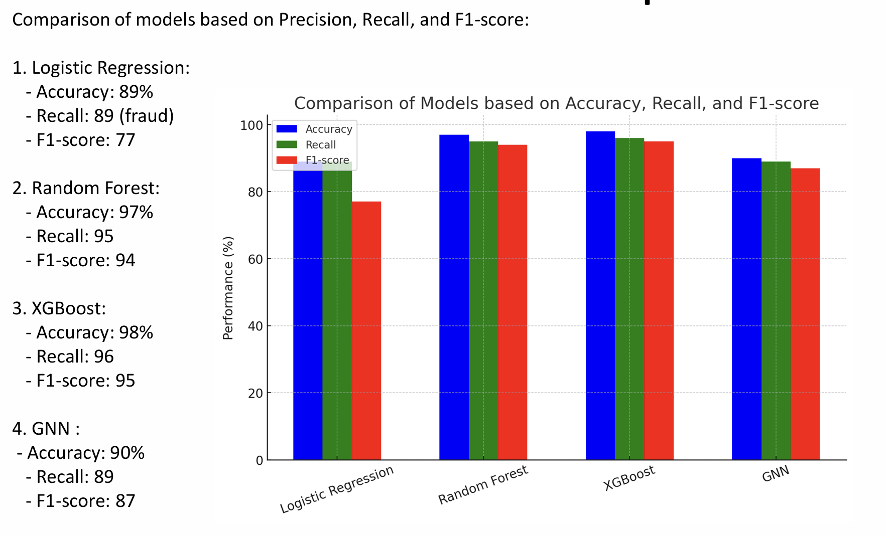
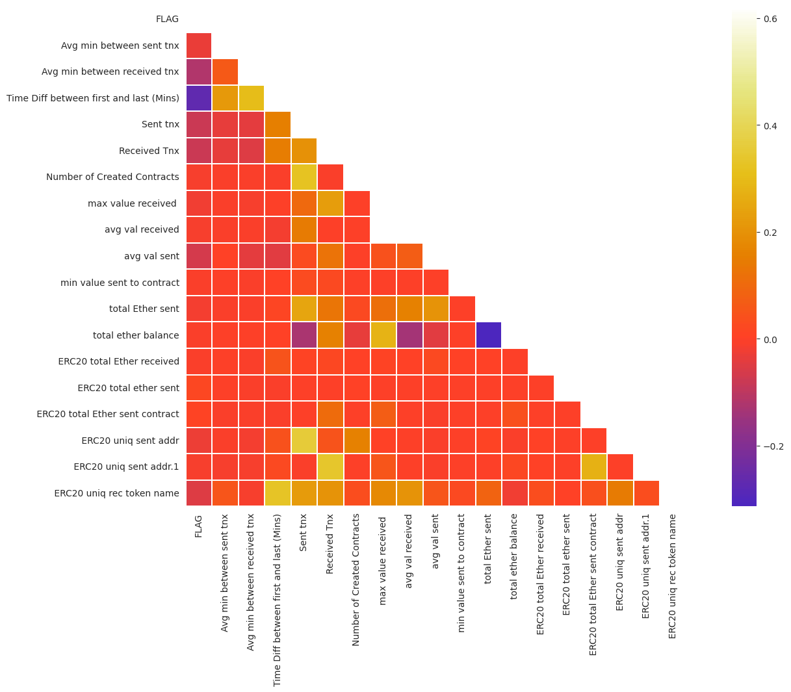

# AI-Powered Fraud Detection in Ethereum Transactions using ML and GNN

## Introduction
This project presents an AI-driven fraud detection system for Ethereum blockchain transactions. It combines traditional machine learning techniques with Graph Neural Networks (GNN) to identify fraudulent activity by modeling both transaction features and relational patterns between blockchain entities.

The project demonstrates why graph-based learning is better suited for blockchain fraud detection compared to standalone tabular models.

## Problem Statement
Blockchain fraud detection is challenging due to:
- Highly imbalanced datasets
- Complex relationships between wallets and transactions
- Evolving and dynamic fraud patterns

Traditional machine learning models often fail to capture relational behavior, leading to missed fraud cases. This project addresses this limitation using graph-based modeling.

## Dataset Overview
- Ethereum transaction dataset containing both fraudulent and legitimate transactions
- Total records: 9,841
- Key features:
  - Ethereum addresses
  - Transaction statistics (sent/received counts and values)
  - ERC20 token transaction metrics
  - Fraud label (FLAG)

## Tech Stack
- Programming Language: Python
- Libraries and Frameworks:
  - Pandas, NumPy
  - Scikit-learn
  - XGBoost
  - NetworkX
  - PyTorch Geometric
- Domain:
  - Blockchain Analytics
  - Fraud Detection
  - Graph Machine Learning

## Methodology
1. Data Preprocessing
   - Handled missing values
   - Normalized numerical features
   - Applied feature scaling
   - Addressed class imbalance using SMOTE
   - Engineered additional features

2. Model Training and Evaluation
   - Logistic Regression
   - Random Forest
   - XGBoost
   - Graph Neural Network (GNN)

3. Graph-Based Modeling
   - Constructed transaction graphs using Ethereum addresses
   - Modeled relationships between entities using graph structures
   - Applied GNN to learn complex interaction patterns

## Model Performance Summary
- Logistic Regression:
  - Accuracy: 89%
  - Recall (Fraud): 89%
  - F1-score: 77%

- Random Forest:
  - Accuracy: 97%
  - Recall: 95%
  - F1-score: 94%

- XGBoost:
  - Accuracy: 98%
  - Recall: 96%
  - F1-score: 95%

- Graph Neural Network (GNN):
  - Accuracy: 90%
  - Recall: 89%
  - F1-score: 87%

## Output Visualization

### Model Performance Comparison
The following visualization compares the performance of all evaluated models (Logistic Regression, Random Forest, XGBoost, and GNN) based on Accuracy, Recall, and F1-score. This comparison highlights the strengths of ensemble and graph-based approaches in detecting fraudulent Ethereum transactions.

### Feature Correlation Analysis
This correlation heatmap illustrates the relationships between key transaction-level features and the fraud label. It provides insights into how transaction behavior, Ether flow, and ERC20 token activity contribute to fraud detection and model decision-making.

## Key Insights
- XGBoost achieved the highest overall classification accuracy
- GNN effectively captured relational transaction patterns
- Graph-based learning provides better generalization for evolving fraud schemes
- Higher recall in GNN models reduces undetected fraud cases

## What I Learned
- Handling imbalanced datasets in fraud detection
- Feature engineering for blockchain transaction data
- Limitations of traditional ML models on relational data
- Designing and training Graph Neural Networks
- Applying graph-based learning to real-world cybersecurity problems

## Future Scope
- Improve GNN architecture for higher recall
- Extend the system to real-time fraud detection
- Apply the framework to other cryptocurrencies
- Integrate streaming transaction analysis

## Repository Contents
- Fraud_Detection_ETHEREUM_transactions.ipynb – Full implementation and experiments
- Fraud_Detection_Presentation.pdf – Project explanation and results
- outputs/ – Model comparison visualizations
